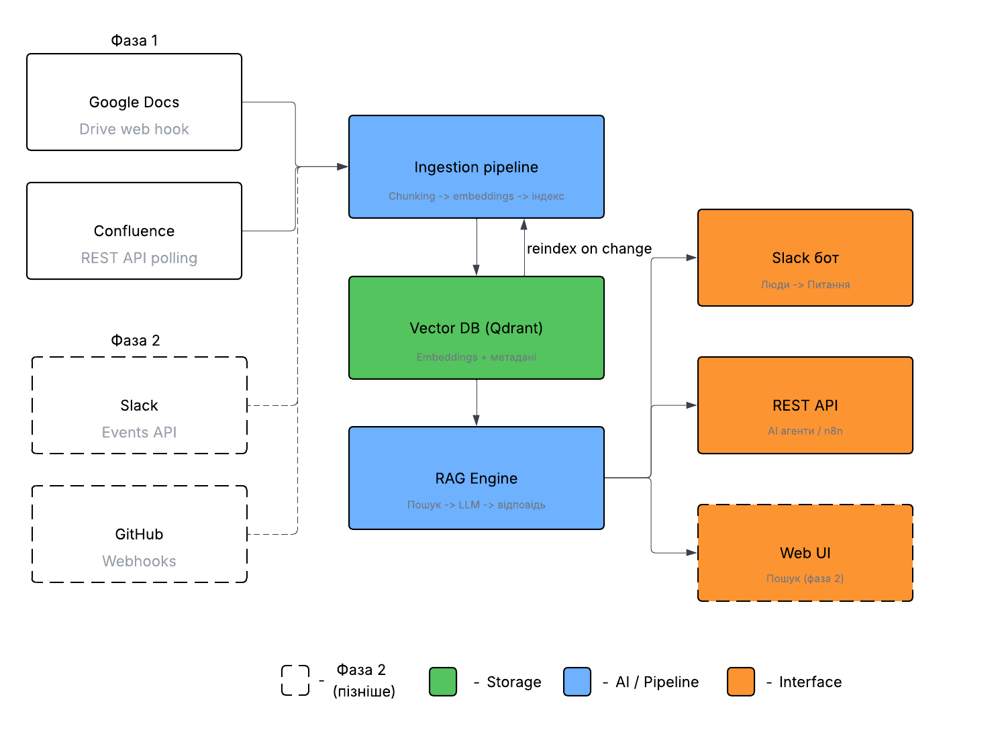

# All Right Brain

Внутрішня AI-база знань компанії All Right.
Концепт-реалізація для тестового завдання на позицію Automation Engineer.

## Огляд

All Right Brain збирає знання з Google Docs, Confluence, Slack та GitHub,
індексує їх через embeddings і дозволяє будь-кому отримати відповідь з посиланням на джерело
через Slack-бот, REST API або Web UI.

## Архітектура



## Структура проєкту

- `ingestion.py` — розбиття документів на чанки, створення embeddings та індексація в Qdrant
- `rag.py` — семантичний пошук та генерація відповіді з посиланням на джерело
- `webhook.py` — FastAPI-сервер, який приймає webhook від Google Drive і тригерить переіндексацію

## Технології

- **Vector DB:** Qdrant
- **Embeddings:** OpenAI `text-embedding-3-small`
- **LLM:** GPT-4o
- **Framework:** FastAPI, LangChain
- **Джерела (фаза 1):** Google Docs, Confluence
- **Джерела (фаза 2):** Slack, GitHub

## Як це працює

1. Документ завантажується → розбивається на чанки → перетворюється на embeddings → зберігається в Qdrant
2. При зміні документу → webhook тригерить автоматичну переіндексацію
3. Користувач ставить питання → семантичний пошук знаходить релевантні чанки → LLM генерує відповідь з посиланням на джерело

## Як запустити

```bash
# 1. Клонувати репозиторій
git clone https://github.com/strixxjs/allright-brain
cd allright-brain

# 2. Створити та активувати virtual environment
python -m venv venv
source venv/bin/activate          # Linux/macOS
# venv\Scripts\activate           # Windows

# 3. Встановити залежності
pip install -r requirements.txt

# 4. Заповнити .env
cp .env.example .env
# далі відкрий .env і встав реальні ключі

# 5. Запустити Qdrant у Docker
docker run -p 6333:6333 qdrant/qdrant

# 6. Запустити webhook-сервер
uvicorn webhook:app --reload
```

Swagger UI буде доступний на `http://127.0.0.1:8000/docs`.

## Обмеження поточної реалізації

Це концепт, а не production-ready код. Для продакшену потрібно:

- Винести створення клієнтів (`QdrantClient`, `OpenAIEmbeddings`, `ChatOpenAI`) в синглтони або FastAPI `Depends`
- Додати retry з exponential backoff для викликів OpenAI та Qdrant (наприклад, через `tenacity`)
- Замінити `uuid.uuid4()` на детермінований id (`hash(source_url + chunk_index)`) для уникнення дублікатів при переіндексації
- Додавати логіку видалення старих чанків по `source_url` перед повторним upsert
- Замінити `datetime.utcnow()` на `datetime.now(timezone.utc)` (перше deprecated у Python 3.12)
- Створювати колекцію в Qdrant з правильним `vector_size=1536` через `get_or_create_collection`
- Додати authentication для webhook endpoint
- Покрити тестами критичні шляхи (ingestion, retrieval)